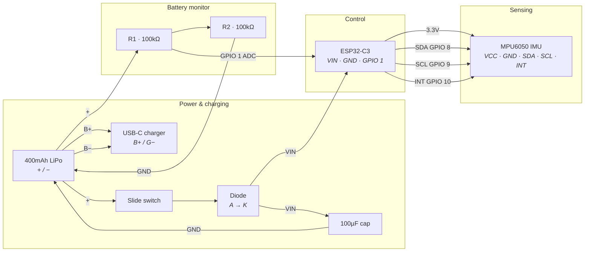

  

# SafeReps: Movement Intelligence for Home Strength Training
### Correct form. Prevent injuries. Know your limits.

SafeReps is a dual-stream coaching ecosystem that bridges the gap between following a workout video and having a personal trainer standing in the room. By fusing phone-based computer vision with a high-fidelity wearable sensor, SafeReps ensures every repetition is safe, effective, and counted with precision.

---

## 🌟 Overview

When you work out alone at home, you're "training blind." Workout videos can't see you, and static apps can't correct your form. SafeReps solves this by building a **Digital Twin** of your performance. 

It detects the "invisible" physics of a rep—muscle tremors and momentum cheating—that no camera can catch alone. The moment your form degrades, the AI voice coach fires immediately to correct you mid-set.

## 🚀 Key Features

*   **Dual-Stream Sensor Fusion**: Merges 30 FPS vision landmarks with 100Hz high-fidelity IMU data.
*   **Invisible Fatigue Detection**: Catch neuromuscular tremors before you feel them to prevent injury.
*   **Cheat Detection**: Distinguishes between clean muscle contraction and momentum-based swinging.
*   **AI Voice Coach**: Priority-gated audio feedback that provides corrections exactly when they happen.
*   **T-Pose Auto-Calibration**: 1-second routine that aligns the wearable to your specific limb geometry.
*   **Hardware Economics**: A professional coaching system built on a $5 BOM, making a $50 retail price possible.

## 🛠 Tech Stack

| Layer | Technology |
| :--- | :--- |
| **Mobile App** | Flutter + Google ML Kit (Pose landmarks at 30 FPS) |
| **Wearable MCU** | ESP32-C3 with Low-Latency BLE |
| **Motion Sensor** | MPU6050 6-axis IMU (100Hz DSP) |
| **DSP Logic** | High-pass tremor isolation + Angular/Linear velocity ratios |
| **State Machine** | 5-stage FSM (Idle → Top → Descending → Bottom → Ascending) |
| **Audio Engine** | Priority-gated coaching with intelligent cue pooling |

---

## 🔌 Hardware Architecture

### Bill of Materials (BOM)
SafeReps is designed for accessibility. Our prototype costs under **$5 in components**, proving that coaching-grade hardware doesn't have to be a luxury product.

*   **ESP32-C3**: Logic & Bluetooth connectivity.
*   **MPU6050**: 6-axis inertial measurement unit.
*   **400mAh LiPo**: Portable power for 12+ hours of active training.
*   **USB-C Module**: Integrated charging.
*   **Protection Circuit**: 100k voltage divider (monitoring) + Diode & Capacitor (safety).

### Wiring Diagram

---

## 🧠 Core Intelligence

### 1. The Rep State Machine
SafeReps manages a **Finite State Machine (FSM)** for every set to ensure movement is anatomically complete. Transitions are triggered by joint angles crossing calibrated thresholds, ensuring reps are only counted when they reach full range.

### 2. High-Speed DSP
The ESP32-C3 wearable performs real-time Digital Signal Processing (DSP) before data hit the app:
*   **Tremor Analysis**: A 100Hz high-pass filter isolates neuromuscular jitter from intentional movement.
*   **Cheat Detection**: Calculates the ratio of *Angular Velocity* to *Linear Acceleration* to catch momentum-based swings.

### 3. T-Pose Calibration
Accuracy starts with alignment. SafeReps requires a 1-second **T-Pose** before every set. This enables:
*   **Sensor Zeroing**: Synchronizes the wearable’s orientation to your skeletal model.
*   **Scaption Alignment**: Defines the reference plane for your specific biomechanics, correcting for mounting tilt.

---

## 🚀 Getting Started

### 1. Hardware Build
Follow the wiring diagram in the hardware section. Use the `safereps-esp` directory for the firmware source.

### 2. Firmware Installation
1.  Navigate to `safereps-esp/`.
2.  Use PlatformIO to upload: `pio run -t upload`.

### 3. App Installation
1.  Ensure the Flutter SDK is installed.
2.  Navigate to `safereps/`.
3.  Run `flutter pub get` followed by `flutter run`.
    *(Note: Use a physical device for full BLE and Camera support.)*

---

## 🔮 Roadmap

*   **LiDAR-Enhanced Tracking**: Integrating front-facing LiDAR for sub-centimeter skeletal depth sensing.
*   **Shadow Boxing**: High-speed strike velocity and "snap" analysis for combat sports.
*   **AR Overlays**: Projecting "ghost reps" over the camera view in real-time.
*   **Physical Therapy**: Expanding the library for home-based rehabilitation and recovery tracking.
*   **Full-Body Fusion**: Multi-sensor support for complex compound movements (Squats/Deadlifts).

---

`ble` · `c++` · `computer-vision` · `dart` · `dsp` · `esp32` · `flutter` · `ml-kit` · `mpu6050` · `platformio`

  <b>Built for MariHacks IX</b> 
  <a href="https://devpost.com">View on Devpost</a>

