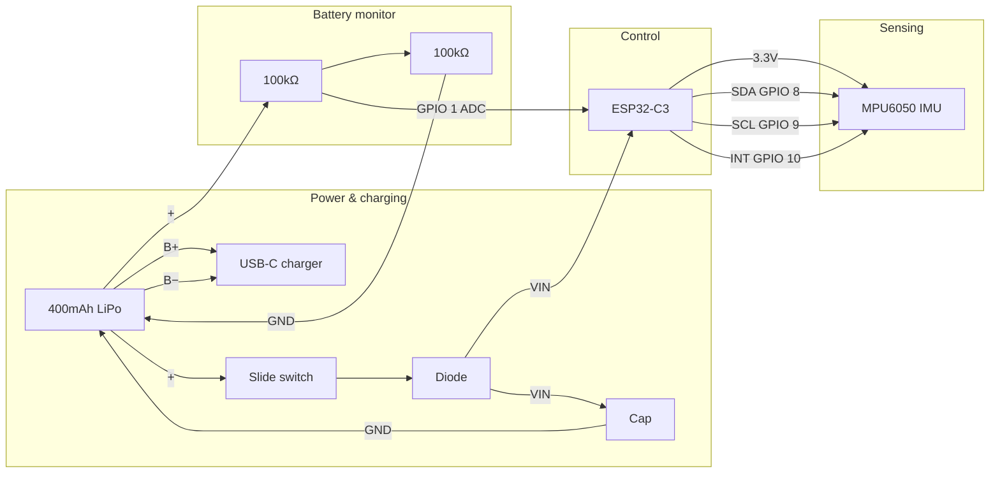

  

# SafeReps
### Movement Intelligence for Home Strength Training
**Every rep. Counted correctly. Coached in real-time.**

---

## 📽️ THE PROBLEM
### "Training in the Dark"
Lifting weights at home is a one-way street. You follow a screen, but the screen can't see you. This creates a dangerous feedback gap:

*   **Invisible Fatigue**: Micro-tremors and form breakdown happen before you feel them.
*   **Zero Feedback**: Static videos can't tell you to straighten your arm or slow your descent.
*   **The Injury Loop**: Undetected bad habits compound into chronic pain (lower back, joints).

---

## 💡 THE SOLUTION
### A Personal Trainer in Your Living Room
SafeReps bridges the gap between a static video and a live coach using a high-fidelity **Sensor Fusion** engine.

> **Sense → Analyze → Correct.**

#### **1. VISION (The Eyes)**
Google ML Kit tracks 33 body landmarks at 30 FPS. It calculates joint angles and spatial positioning using only your phone.

#### **2. WEARABLE (The Senses)**
A sub-$50 DIY wrist module capturing motion at 100Hz. It detects the "invisible" physics—momentum cheating and fatigue tremors—that cameras miss.

#### **3. COACH (The Voice)**
A priority-gated AI coach that provides real-time guidance. Corrections like *"Slow down"* fire the moment your form breaks, not after the set is over.

---

## 🧠 THE "SECRET SAUCE"
### High-Fidelity DSP & Logic

#### **🚀 High-Speed DSP**
The ESP32-C3 performs real-time Digital Signal Processing (DSP) before data ever hits the app:
*   **Tremor Analysis**: A 100Hz high-pass filter isolates neuromuscular jitter from intentional movement.
*   **Cheat Detection**: Calculates the ratio of *Angular Velocity* to *Linear Acceleration* to catch momentum-based swings.

#### **🔄 The Rep State Machine**
A 5-stage Finite State Machine (FSM) ensures every rep is anatomically complete:
`Idle → Top → Descending → Bottom → Ascending`

---

## ⚖️ THE SETUP
### T-Pose Calibration
**Accuracy starts with alignment.**
SafeReps requires a 1-second **T-Pose** before every set. This enables:
1.  **Sensor Zeroing**: Synchronizes the wearable’s orientation to your skeletal model.
2.  **Scaption Alignment**: Defines the reference plane for your specific biomechanics.

---

## 🛠️ THE HARDWARE
### Accessible. High-Performance. $49.

| Component | Role |
| :--- | :--- |
| **ESP32-C3** | Logic & Low-Latency Bluetooth |
| **MPU6050** | 6-Axis IMU (Sensing) |
| **LiPo 400mAh** | Wireless Power |
| **100k Resistors**| Battery Monitoring Divider |
| **Components** | Protection Diode & Smoothing Capacitor |

### Hardware Diagram

---

## 🔮 THE FUTURE
*   **🥊 Shadow Boxing**: Strike velocity and "snap" analysis for combat sports.
*   **🕶️ AR Overlays**: Visual "ghost reps" projected over your body in real-time.
*   **🏥 Physical Therapy**: High-fidelity tracking for home-based rehabilitation.

---

  <b>Built for those who lift smart.</b> 
  Check the <code>/safereps</code> and <code>/safereps-esp</code> folders to get started.

