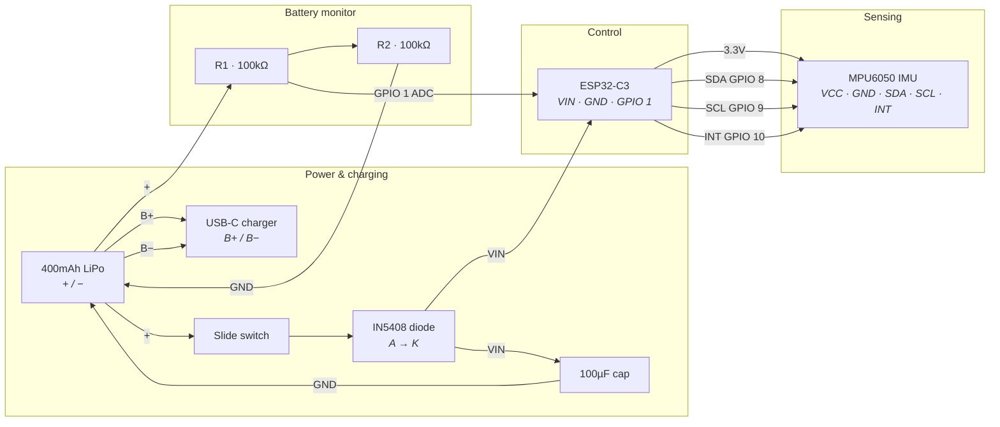

<p align="center">
  
</p>

# SafeReps: Movement Intelligence for Strength Training

SafeReps is a next-generation coaching ecosystem that removes the guesswork from strength training. By combining the "eyes" of your phone's camera with the "feeling" of a high-precision wearable, SafeReps builds a live digital model of your body to ensure every repetition is safe, effective, and high-quality.

---

## 💡 Why SafeReps?

Most fitness trackers do one thing: count numbers. But in strength training, **quality is everything**. As you get tired, your form breaks down in tiny ways that you can't always feel. You might start swinging your body to cheat the weight up, or your muscles might begin to tremble—a sign of true fatigue.

SafeReps catches these mistakes before they lead to injury. It doesn't just tell you how many reps you did; it tells you if they were the **right** reps.

---

## 🧠 How It Works: Sensor Fusion

SafeReps uses a dual-stream intelligence layer known as **Sensor Fusion**:

1.  **Vision (The eyes)**: Your phone camera uses advanced AI (Google ML Kit) to track 33 body landmarks at 30 FPS. It calculates skeletal joint angles (like elbow or knee extension) in 2D image space using trigonometric dot products.
2.  **The Wearable (The senses)**: A custom-mounted wrist module captures movement at 100Hz. This picks up subtle "micro-movements" that computer vision is too slow to see, such as tremors, rotational torque, and sudden spikes in momentum.
3.  **The Digital Twin**: SafeReps timestamp-aligns the 30Hz vision frames with the high-speed sensor stream. This creates a "Digital Twin" of your performance where vision provides the **context** (the joint position) and the wearable provides the **intensity** (the quality and stability).

---

## 💻 Software Logic & Algorithms

### 1. The Rep State Machine
SafeReps doesn't just look for a single movement; it manages a **Finite State Machine (FSM)** for every set:
- **Idle**: Waiting for the user to reach the starting position.
- **Top**: User is at the peak of the movement; the system prepares to track the descent.
- **Descending**: Monitoring speed and range as the weight is lowered.
- **Bottom**: The "turn-around" point where tension is highest.
- **Ascending**: Tracking the drive back to the start.

Transitions between these states are triggered when joint angles cross calibrated thresholds (e.g., 160° for extension and 40° for contraction).

### 2. High-Speed IMU Analysis
The ESP32-C3 wearable performs real-time Digital Signal Processing (DSP) before sending data to the app:
- **Tremor Detection**: A first-order high-pass filter isolates high-frequency muscle vibrations (jitter) from the regular movement of the exercise. This score represents how much your muscle is struggling to stabilize the weight.
- **Cheat Detection**: The system calculates the ratio of **Angular Velocity** to **Linear Acceleration**. In a "clean" rep, your muscle generates linear force. In a "cheat" rep, you use a circular body swing to generate momentum; the sensor detects this specific physical signature and flags it immediately.
- **Plane Monitoring**: SafeReps monitors Yaw, Pitch, and Roll to ensure your arm stays in the correct anatomical plane (e.g., the Scaption plane for lateral raises). If your arm drifts too far forward or backward, a violation is recorded.

### 3. AI Voice Coaching Engine
The voice coaching logic follows a strict prioritization and gating system:
- **Exhaustion Shuffling**: The system uses a Fisher-Yates shuffle to manage pools of hundreds of unique audio cues. This ensures you never hear the same tip twice until the entire "deck" has been played.
- **Priority Gating**: Corrections (like "Slow down") have a higher priority score than positive reinforcement (like "Good rep"). If a correction is triggered, it will immediately "duck" the background audio and interrupt any lower-priority cues.
- **Gated Randomness**: To avoid "coach fatigue," cues are gated by a probability roll. You can adjust the **Frequency** and **Positive Mix** in the settings to tune how talkative the AI is based on your preference.

### 4. The T-Pose & Real-Time Calibration
SafeReps requires a brief "T-Pose" (arms held straight out to the sides) for 1 second before the start of every set. This is a critical calibration step for several reasons:

- **Vision-to-Sensor Alignment**: By seeing your body in a known posture (the T-pose), the app can "zero" the wearable's orientation. This corrects for the sensor being mounted at a slight tilt on your arm or for any Bluetooth orientation drift that may have occurred between sets.
- **Scaption Plane Definition**: For exercises like Lateral Raises, the "T-Pose" establishes the reference horizontal plane. This allows the app to detect if your arm drifts forward or backward (Yaw/Roll violations) with sub-degree accuracy.
- **Biometric Scaling**: The T-pose helps the vision model understand your arm length and proportions, which improves the accuracy of calculating joint angles during the actual repetitions.
- **User Readiness**: It serves as a physical "ready" signal to the AI coach, ensuring you are in a controlled, stable position before the heavy weights begin moving.

---

## 🛠 Hardware Architecture

The SafeReps wearable is built to be lightweight, high-speed, and easy to assemble.

### Component List
- **Controller**: ESP32-C3 (Small form factor with built-in Bluetooth)
- **Sensor**: MPU6050 (6-axis Motion Sensor)
- **Battery**: 400mAh LiPo (3.7V)
- **Power Management**: USB-C LiPo Charger module
- **Protection**: IN5408 Diode (Prevents reverse current)
- **Monitoring**: 2x 100k Ohm Resistors (Voltage divider for battery level)
- **Smoothing**: 100uF Electrolytic Capacitor
- **Control**: SPST Slide Switch

### Wiring Diagram


### Detailed Wiring Instructions
1.  **Battery & Charging**: Connect your **LiPo Battery** to the **B+** and **G-** pads of the **USB-C Charger**.
2.  **Main Power Path**: Run a wire from the Battery (+) to your **Slide Switch**. From the other side of the switch, connect to the Anode (side without the stripe) of the **IN5408 Diode**.
3.  **Voltage Input**: Connect the Cathode (side with the stripe) of the **Diode** to the **5V / VIN** pin of the **ESP32-C3**.
4.  **Grounding**: Connect the Battery (-) to the **GND** pin of the **ESP32**.
5.  **Smoothing**: Connect the **100uF Capacitor** between the **5V/VIN** pin and the **GND** pin.
6.  **Battery Monitoring**: Connect the two **100k Resistors** in series. Connect one end to the Battery (+), the other end to GND. Connect the point between the two resistors back to **GPIO 1** on the ESP32.
7.  **Sensor Wiring**: Connect the **MPU6050** to the ESP32:
    - **VCC** to **3.3V**
    - **GND** to **GND**
    - **SCL** to **GPIO 9**
    - **SDA** to **GPIO 8**
    - **INT** to **GPIO 10**

---

## ⚖️ Intelligence Layers

### Automated Form Coaching (Cheat Detection)
SafeReps measures the ratio between your arm's rotation and the force your muscles are generating. If you use a "pendulum" swing to lift the weight instead of pure muscle contraction, the system flags it as a "Cheat Rep" and the AI coach will tell you to slow down.

### Fatigue Tracking (Tremor Analysis)
The wearable senses high-frequency jitter in your movement—the kind you often can't see with the naked eye. This "tremor score" is a leading indicator of neuromuscular fatigue. The app uses this to suggest when you should stop the set to avoid injury.

### Zero-Config Alignment
You don't need to mount the sensor perfectly straight on your arm. During your first warm-up repetition, SafeReps analyzes the plane of motion and automatically software-aligns the sensor's coordinate system to your limb.

---

## 📱 Mobile Experience

### AI Voice Coach
SafeReps features a real-time audio coach. It doesn't just talk at you; it listens to the sensor data and provides context-aware feedback like "Keep your arm straight" or "Control the descent" exactly when it happens.

### Premium "Liquid Glass" UI
The interface is designed for the high-intensity gym environment. Using a "Liquid Glass" aesthetic with high-contrast, matte colors and frosted glass effects, it remains readable even under bright overhead gym lights and from several feet away.

---

## 🚀 Getting Started

### 1. Build the Hardware
Follow the **Wiring Diagram** above to assemble your wearable. Ensure your solder joints are clean to avoid data noise.

### 2. Flash the Firmware
1.  Connect your ESP32-C3 to your computer via USB.
2.  Navigate to `safereps-esp/` and use PlatformIO to upload:
    ```bash
    pio run -t upload
    ```

### 3. Install the App
1.  Ensure you have Flutter installed.
2.  Run the following commands:
    ```bash
    cd safereps
    flutter pub get
    flutter run
    ```
    *(Note: Use a physical iOS or Android device for Bluetooth and Camera features.)*

---

## 🔮 The Future: Beyond the Rep

SafeReps is evolving into a complete movement intelligence platform:

*   **Shadow Boxing**: High-speed tracking for combat sports, measuring punch velocity and "snap."
*   **AR Coaching Overlays**: Projecting "ghost reps" over your camera view so you can see the perfect path for your exercise.
*   **Rehabilitation Care**: Clinical-grade tracking for physical therapy, ensuring patients follow recovery movements with sub-degree precision.
*   **Full-Body Support**: Connecting multiple sensors to track complex movements like Squats and Deadlifts simultaneously.

---
<p align="center">Built for those who lift heavy and lift smart.</p>
